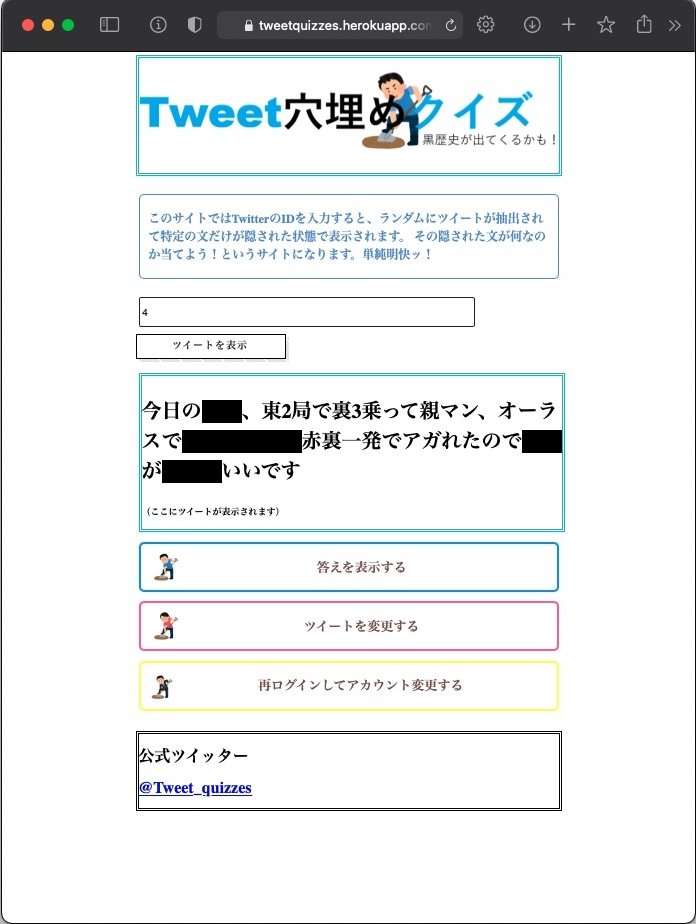

# 情報工学実験IV Webアプリケーション開発

# 1.概要
- フレームワークを活用した開発演習を行うことで，Webアプリケーション開発の基礎を身につける．


# 2.開発したWebアプリケーションの概要
開発したアプリケーションは[https://tweetquizzes.herokuapp.com](https://tweetquizzes.herokuapp.com)で公開している．
またソースコードは[straxFromIbr/expiv_webapp](https://github.com/straxFromIbr/expiv_webapp)にある．

## Webアプリケーションの機能
私たちが開発したアプリケーションは，Twitterアカウントと連携し，ユーザーの過去のツイートを取得しユーザーが指定した数の単語にマスクをかけることで「単語あてクイズ」を作成するサービスを提供するものである．

## 環境
フレームワークにはPython製のDjangoを使用し，WSGIサーバにはGunicornを使用した．また，アプリケーションはheroku上にデプロイした．
使用した主なパッケージ・ライブラリなどのバージョンは次の通りである．

- Python : 3.8.10
  - Django : 3.2.4
  - gunicorn : 20.1.0
  - django-heroku : 0.3.1
  - requests-oauthlib : 1.3.0
  - mecab-python3 : 1.0.3
  - unidic-lite : 1.0.8
- Stack : heroku-20

## アプリケーションの外観
アプリケーションは次のような外観である．


## ソースコードのツリー
当アプリケーションは次のようなディレクトリ構造となっている．
```tree
.
├── Procfile
├── db.sqlite3
├── expiv
│   ├── __init__.py
│   ├── asgi.py
│   ├── settings.py
│   ├── urls.py
│   └── wsgi.py
├── manage.py
├── requirements.txt
├── runtime.txt
├── staticfiles
└── twquiz
    ├── __init__.py
    ├── admin.py
    ├── apps.py
    ├── migrations
    │   └── __init__.py
    ├── models.py
    ├── pyscripts
    │   ├── README.md
    │   ├── get_oatoken.py
    │   ├── local_settings
    │   │   └── apikeys.py
    │   ├── masktweets.py
    │   └── wakati.py
    ├── static
    │   └── twquiz
    │       ├── icon
    │       │   ├── android-icon-144x144.png
   ~~~~省略~~~~~~~ 
    │       │   └── ms-icon-70x70.png
    │       ├── images
    │       │   └── header.PNG
    │       └── styles
    │           └── button.css
    ├── templates
    │   └── twquiz
    │       ├── autherr.html
    │       └── index.html
    ├── tests.py
    ├── urls.py
    └── views.py

13 directories, 55 files

```
# 3.分担
SAが当アプリケーションの発案と[メインページ](https://tweetquizzes.herokuapp.com)のHTMLとCSSの作成．KMはfabiconとエラーページの作成を担当した．ITは[メインページ](https://tweetquizzes.herokuapp.com)において隠す単語の位置や数を変えたりするなどの動的な要素を作成した．HGはTwitter APIからのツイート取得，ユーザ認証などバックエンドとクラウドへのデプロイを担当した．

## 分担した部分の機能の概要
- **アプリケーション認証**  

	　非公開アカウントのユーザーでも使用できるよう，3-legged OAuthによるアプリケーション認証を行うような処理とした．認証されたユーザーのCookieにユーザーアクセストークンを登録し，セッションが途切れるまでそれを使用する．セッションの有効期限は短めにし120秒とした．次がアプリケーション認証の大まかな流れである． なおリダイレクトなどは`tweetquizzes/twquiz/views.py`内で実装し，トークン取得のためのOAuth1Sessionの確立は`tweetquizzes/twquiz/pyscripts/get_oatoken.py`で実装している．

	- セッション未確立のユーザー
		1. ルート(`/`)にアクセス．セッションが未確立なので`/account`にリダイレクト．
		2. `/account`で，エンドポイントURLを取得し，Twitterのアプリケーション認証画面にリダイレクト．
		3. `/auth`にコールバック．ユーザーアクセストークンを取得しCookieに登録，ルート(`/`)にリダイレクト．
		4. Cookieに登録されたトークンでツイート取得．

	- セッション確立済みのユーザ
		1. ルート(`/`)にアクセス．登録されたトークンでツイート取得．

	- エラー時
		`autherr.html`で`/account`へのリンクとメッセージを表示する．

- **取得したツイートの字句解析**  
	　上記の認証フローで得られたアクセストークンで取得したツイートは，URLやリツイートを取り除いたのち，MeCabにより形態素に分解する．また，より面白いクイズとなるよう助詞などの付属語，非自立可能名詞・動詞などをマスクをかける対象から取り除く前処理を行う．ツイートの取得は`/twquiz/pyscripts/mask_tweets.py`に，形態素解析を用いた処理は`/twquiz/pyscripts/wakati.py`で実装してある．次に処理の例を示す． 

	```python
	>>> from wakati import Wakati
	>>> text = "Twitter（ツイッター）は、アメリカ合衆国・カリフォルニア州サンフランシスコに本社を置くTwitter, Inc.のソーシャル・ネットワーキング・サービス (SNS)（情報サービス[15][16]）。「ツイート」と呼ばれる半角280文字（日本語、中国語、韓国語は全角140文字）以内のテキストや画像、動画、URLを投稿できる。"
	>>> w = Wakati(text)
	>>> w.add_multifilters()
	>>> ' '.join(w.apply_filter())
	'Twitter ツイッター アメリカ 合衆 カリフォルニア 州 サンフランシスコ 本社 Twitter Inc ソーシャル ネット ワーキング サービス SNS 情報 サービス ツイート 呼ば 半角 文字 日本 語 中国 語 韓国 語 全角 文字 以内 テキスト 画像 動画 URL 投稿'
	>>>
	>>> w.filter_idx
	[0, 2, 6, 7, 10, 11, 12, 14, 17, 19, 22, 24, 25, 27, 29, 32, 33, 39, 42, 44, 46, 48, 49, 51, 52, 54, 55, 57, 59, 61, 63, 65, 67, 69, 71]
	>>>
	>>> ' '.join(w.get_removed())
	'（ ） は 、 国 ・ に を 置く , . の ・ ・ ( ) （ [ 15 ][ 16 ]）。「 」 と れる 280 （ 、 、 は 140 ） の や 、 、 を できる 。'

	```
	`Wakati.add_multifilters()`メソッドは次のように指定した品詞種・属性を持つ形態素のインデックスを`Wakati.filter_idx`から除外するものである．

	```python Wakati.py
	def add_multifilters(self):
        """
        助詞，助動詞，接尾辞，接頭辞，接続詞，空白，記号，補助記号，非自立，非自立可能な単語をフィルタリング
        """
        # level 1 filter
        self.attr_filter("助詞")
        self.attr_filter("助動詞")
        self.attr_filter("接尾辞")
        self.attr_filter("接頭辞")
        self.attr_filter("接続詞")
        self.attr_filter("空白")
        self.attr_filter("記号")
        self.attr_filter("補助記号")

        # level 2 filter
        self.attr_filter("非自立", lvl=1)
        self.attr_filter("非自立可能", lvl=1)
        self.attr_filter("数詞", lvl=1)
	```

	`' '.join(w.apply_filter())`の結果を見ると，隠すことでクイズとして成立しそうな単語が抽出されていることがわかる．しかし，`日本語`が`日本`と`語`の2つの形態素に別れてしまっているなどの課題がある．これは辞書として一般に使用されるより小規模な`unidic-lite`を使用しているためであると思われる．


# 4.感想・考察
　    
　今回の実験で初めて使用したDjangoは過去に使ったことのあるflaskに比べ，データベースとの連携を前提としていたり，メインのサイトにアプリケーションを追加していく構造となっていたりするなど，大規模なアプリケーション向けのフレームワークであり，当アプリケーションのようにほとんど単一ページで完結するようなものには不適当である印象を受けた．  
　デプロイの面では，前項でも触れたようなMeCabで使用する辞書のインストールなどはPythonアプリケーションの外側で行う必要がある操作は今回の方法では不可能と見られる．その解決法としてDockerで作成したコンテナイメージをデプロイする方法が考えられる．

# 参考
参考にしたインターネット上の記事のうち主要なものを挙げる．
- [[Python] OAuth認証でTwitter連携/ログインを実装する](https://qiita.com/mikan3rd/items/686e4978f9e1111628e9)
- [Djangoチュートリアル](https://docs.djangoproject.com/ja/3.2/intro/)
- [Heroku スターターガイド (Python)](https://devcenter.heroku.com/ja/articles/getting-started-with-python#procfile)
- [Heroku のための Django アプリの設定](https://devcenter.heroku.com/ja/articles/django-app-configuration)
- [Herokuでmecab-python3を使う](https://qiita.com/shimajiroxyz/items/1a7629e6c5da907b2926)